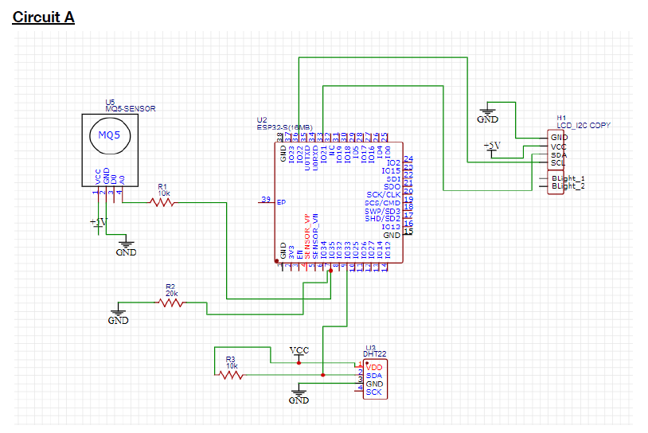
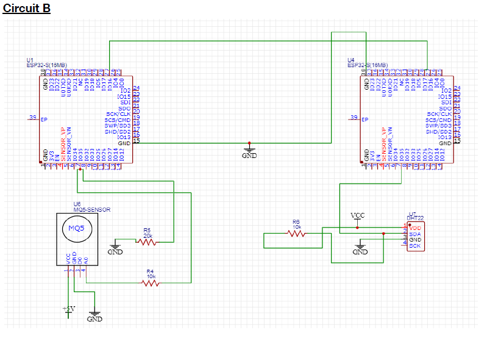
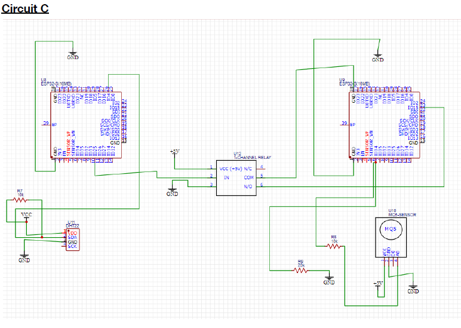

# IOT-Group-1
Semester Project for Group 1, IOT 4.1 B

# Environmental Requirements for Growing Roses

Roses (Rosa spp.) are among the world's most cultivated flowering plants. Achieving quality blooms requires maintaining precise environmental conditions throughout the growing cycle. The following section documents the six key environmental parameters your team will monitor.

---

### a. Optimal Temperature Range

Roses flourish in warm days and cool nights. Daytime temperatures of 18°C–30°C promote vegetative growth and bloom production. Night temperatures of 10°C–16°C help in flower bud initiation. Temperatures consistently exceeding 35°C cause the plant to go dormant, while frost (below 0°C) damages stems.

---

### b. Optimal Relative Humidity Range

A relative humidity (RH) of 60%–70% provides the best conditions for growth and quality flower production, supported by approximately 12 hours of daylight. During hot months in protected cultivation, the target can be reduced to 50%–60%. RH above 80% encourages fungal diseases, particularly powdery mildew and black spot.

---

### c. Recommended Soil Type

Roses perform best in well-drained loamy soil, a balanced mixture of sand, silt, and clay with 4%–6% organic matter. Loam holds moisture adequately while preventing waterlogging. Sandy-clay blends are also suitable. The soil profile should be deep (at least 50 cm), rich in organic matter, and free of stones and gravel.

---

### d. Optimal Soil Moisture Content

Roses require consistently moist, but never saturated, soil. The target soil moisture is 50%–70% of field capacity. Water should penetrate 18–24 inches to reach the root zone. Overwatering (saturation) excludes oxygen and causes root rot. Water when the top 1 inch of soil feels dry, typically once per week in moderate climates.

---

### e. Optimal Soil pH Range

Roses prefer slightly acidic to neutral soil with a pH of 6.0–7.0. The widely cited optimum is pH 6.5. Below pH 6.0, iron and manganese become too soluble; above pH 7.0, nutrients such as iron and phosphorus become unavailable. Adjust using agricultural limestone (raise pH) or sulfur/aluminium sulfate (lower pH).

---

### f. Suitable Sunlight Exposure

Roses require at least 6–8 hours of direct sunlight per day for best bloom production. A 12-hour photoperiod is ideal for year-round flowering under protected cultivation. Morning sunlight is preferred as it dries leaf dew quickly, reducing fungal disease risk. In extreme heat (>32°C afternoon), light afternoon shade can prevent scorching.

---

## Table 1: Rose Environmental Requirements Reference Table

| **Environmental Parameter** | **Optimal Value / Range** | **Notes** |
|:---|:---:|:---|
| a. Temperature (Day) | 18°C – 30°C (64–86°F) | Night minimum: 10°C; daytime optimum 25–30°C. Above 35°C causes dormancy. |
| a. Temperature (Night) | 10°C – 16°C (50–61°F) | Cool nights promote bud set and quality blooms. |
| b. Relative Humidity | 60% – 70% | Poly-house target: 50–60% in hot months. >80% promotes fungal disease (mildew). |
| c. Soil Type | Well-drained loamy soil | Loam (sand + silt + clay) with 4–6% organic matter. Sandy-clay blend also suitable. Avoid waterlogging. |
| d. Soil Moisture Content | 50% – 70% field capacity | Keep consistently moist to ~18–24 inch root depth. Water when top inch feels dry. Never saturate. |
| e. Soil pH Range | 6.0 – 7.0 | Slightly acidic to neutral. Optimum 6.5. Add lime to raise pH; sulfur or peat moss to lower. |
| f. Sunlight Exposure | 6 – 8 hours/day | Direct sunlight preferred; 12-hour photoperiod ideal for year-round bloom. Morning sun reduces fungal risk. |

---

## Table 2: Hardware Components List – Rose Environmental Monitoring Device

| **No.** | **Hardware Component** | **Purpose** | **Qty** | **Product Reference** |
|:---:|:---|:---|:---:|:---|
| 1 | ESP32S DevKit WiFi + BLE Module (30 Pin) | Main microcontroller that reads sensor data, processes information, controls outputs, and manages the overall system. | 1 | [ESP32 Datasheet](https://www.espressif.com/sites/default/files/documentation/esp32_datasheet_en.pdf) |
| 2 | DHT22 (AM2302) Temperature and Humidity Sensor | Measures ambient temperature and relative humidity around the rose plant. | 1 | [DHT22 Datasheet](https://cdn-shop.adafruit.com/datasheets/DHT22.pdf) |
| 3 | Capacitive Soil Moisture Sensor | Measures soil moisture levels to determine whether the rose plant requires watering. | 1 | [SEN0193 Wiki](https://wiki.dfrobot.com/Capacitive_Soil_Moisture_Sensor_SKU_SEN0193) |
| 4 | Analog Soil pH Sensor Module (SEN0161 or Equivalent) | Measures soil pH to ensure it remains within the optimal range (pH 6.0–7.0) for rose growth. | 1 | [SEN0169 Wiki](https://wiki.dfrobot.com/Analog_pH_Meter_Pro_SKU_SEN0169) |
| 5 | BH1750 Light Intensity Sensor | Measures light intensity (lux) and helps determine the number of sunlight exposure hours received by the plant. | 1 | [BH1750 Docs](https://components101.com/sensors/bh1750-ambient-light-sensor) |
| 6 | MQ-5 LPG/Natural Gas Sensor | Detects LPG, methane, propane, and butane gases as required by the project specifications. | 1 | [MQ-5 Datasheet](https://www.sparkfun.com/datasheets/Sensors/Biomedical/MQ-5.pdf) |
| 7 | 1.3" White IIC 128×64 OLED Display (SSD1306) | Displays real-time sensor readings and system status information. | 1 | [SSD1306 Datasheet](https://cdn-shop.adafruit.com/datasheets/SSD1306.pdf) |
| 8 | 5V 1-Channel Low-Level Trigger Relay Module | Allows automatic control of external devices such as a water pump, fan, alarm, or grow light. | 1 | [Relay Module Docs](https://components101.com/switches/5v-single-channel-relay-module-pinout-features-applications-working-datasheet) |
| 9 | Breadboard (830 Tie-Point) | Provides a temporary platform for assembling and testing the circuit. | 1 | — |
| 10 | Jumper Wires (Male-to-Male and Male-to-Female) | Used to create electrical connections between the ESP32, sensors, display, and relay module. | 1 Set | [Jumper Wire Guide](https://www.wiltronics.com.au/wiltronics-knowledgebase/what-are-jumper-wires/) |
| 11 | USB Cable for ESP32 Programming | Used for programming the ESP32 and supplying power during development and testing. | 1 | [USB Cable Docs](https://docs.rs-online.com/6364/A700000008880799.pdf) |

---

## Schematic Diagrams

### Circuit A

**Figure 1.1 — 1 ESP32S connected to 1 MQ-5, 1 DHT22 and 1 LCD**

---

### Circuit B

**Figure 1.2 — 1 ESP32S connected to 1 MQ-5 interfaced directly with another ESP32S**

---

### Circuit C

**Figure 1.3 — 1 ESP32S connected to 1 DHT22 connected to 1 relay, which is connected to 1 MQ-5**

